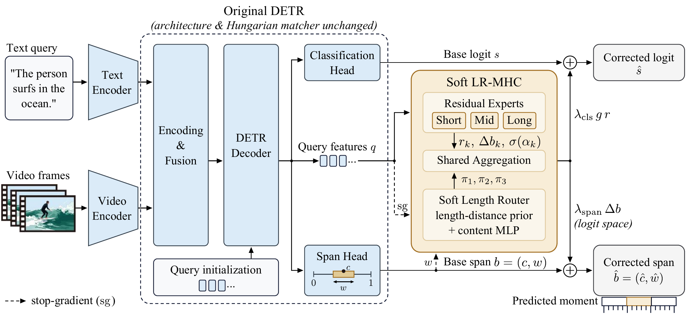
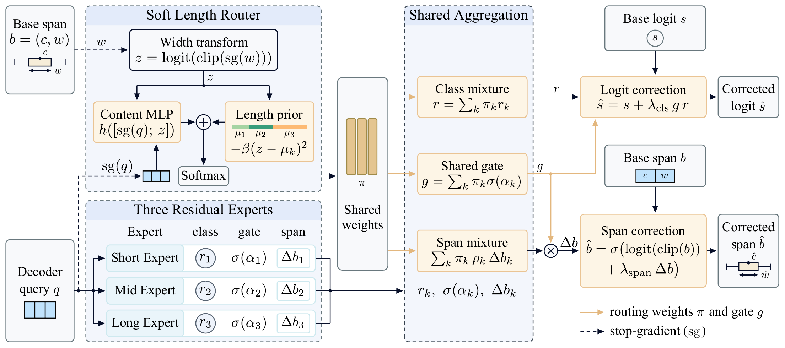

<div align="center">

# Soft Length-Routed Multi-Head Correction for Query-Based Video Moment Localization

**Ziheng Cheng**<sup>1,2</sup>, **Fengyin Huang**<sup>1,2,3</sup>, **Chenyang Wang**<sup>4</sup>, **Haihan Duan**<sup>1,2,*</sup>

<sup>1</sup> Artificial Intelligence Research Institute, Shenzhen MSU-BIT University, Shenzhen, China<br>
<sup>2</sup> Guangdong-Hong Kong-Macao Joint Laboratory for Emotion Intelligence and Pervasive Computing, Shenzhen, China<br>
<sup>3</sup> School of Automation, Beijing Institute of Technology, Beijing, China<br>
<sup>4</sup> Guangdong Laboratory of Artificial Intelligence and Digital Economy (SZ), Shenzhen, China<br>
<sup>*</sup> Corresponding author

</div>

<p align="center">
  
</p>
<p align="center"><em>Figure 1. Architecture of Soft LR-MHC.</em></p>

## Abstract

Video moment localization retrieves the temporally bounded segment of an untrimmed video that matches a natural-language query, and query-based DETRs are currently the dominant framework for this task. However, these models share one classification and interval head for all candidate moments, compressing duration-dependent distributional differences into a common decision boundary. To address this limitation, we propose **Soft LR-MHC**, a residual adapter attached to the query output of any query-based DETR without modifying its encoder, decoder, or Hungarian matcher. Reading the query feature, predicted width, base foreground logit, and base interval, it produces corrected scores and intervals via a distance-and-content soft router with ordered length prototypes, classification and span residual experts with shared routing weights, and reliability gating with gradient isolation. Across five DETRs, two benchmarks, and three seeds (210 runs), all 55 available mAP cells showed positive three-seed mean changes over the corresponding base models, with the soft length router as the largest contributor (+0.523 mAP points on average, 29/30 positive), making Soft LR-MHC a general-purpose output adapter for query-based DETRs exposing the required interfaces.

## Method

From the last decoder layer, Soft LR-MHC reads the query feature $q_i$, the predicted width $w_i$, the base foreground logit $s_i$ and the base interval $b_i = (c_i, w_i)$, and outputs a corrected score and a corrected interval. It consists of three parts:

1. **Distance-and-content soft length router.** The detached width is mapped to logit space, $z_i = \mathrm{logit}(\mathrm{clip}(\mathrm{sg}(w_i)))$. Three learnable ordered prototypes $\mu_1 < \mu_2 < \mu_3$ give a length-distance prior $-\beta (z_i - \mu_k)^2$, and a two-layer GELU MLP over $[\mathrm{sg}(q_i); z_i]$ adds a content correction. A softmax turns the sum into continuous routing weights $\pi_{ik}$ over short, mid and long experts.
2. **Classification and span residual experts.** Each expert is a single linear map that outputs a scalar logit residual $r_i^{(k)}$ and a two-dimensional span residual $\Delta b_i^{(k)}$. Both are mixed with the same routing weights.
3. **Reliability gating with gradient isolation.** A query-specific gate $g_i = \sum_k \pi_{ik}\,\sigma(\alpha_k)$ scales the mixed residuals. The corrected foreground logit is $\hat{s}_i = s_i + \lambda_{\mathrm{cls}}\, g_i\, r_i$, and the corrected interval is $\hat{b}_i = \sigma\big(\mathrm{logit}(\mathrm{clamp}(b_i)) + \lambda_{\mathrm{span}}\, \Delta b_i\big)$. A stop-gradient blocks the direct gradient path from the router to its inputs.

The adapter adds less than 0.1% of the host model's parameters.

<p align="center">
  
</p>
<p align="center"><em>Figure 2. Computation flow of Soft LR-MHC on each query.</em></p>

## Main Results

Three-seed means as reported in the paper.

**QVHighlights (val)**

| Method | R1@0.5 | R1@0.7 | R1 Avg. | mAP@0.5 | mAP@0.75 | mAP Avg. | HD mAP | HD HIT@1 |
|---|---|---|---|---|---|---|---|---|
| SG-DETR | 76.75 | 62.63 | 58.63 | 77.81 | 61.72 | 60.09 | 45.68 | 74.89 |
| + Soft LR-MHC | **76.78** | **62.73** | **58.88** | **77.97** | **61.84** | **60.18** | **45.77** | **75.27** |
| QD-DETR | 61.74 | 45.89 | 40.28 | 61.50 | 40.22 | 39.75 | 38.11 | 62.15 |
| + Soft LR-MHC | 62.05 | 46.03 | 40.64 | 61.74 | 40.85 | 40.06 | 38.21 | 62.32 |
| CG-DETR | 65.84 | 49.49 | 44.32 | 66.38 | 44.68 | 44.16 | 39.43 | 64.60 |
| + Soft LR-MHC | 65.87 | 49.87 | 44.43 | 66.55 | 44.84 | 44.27 | 39.65 | 64.84 |
| TR-DETR | 67.09 | 51.07 | 46.64 | 66.37 | 46.51 | 45.56 | 40.76 | 64.95 |
| + Soft LR-MHC | 67.11 | 51.52 | 47.16 | 66.85 | 47.12 | 45.93 | 41.15 | 65.09 |
| UVCOM | 64.98 | 51.52 | 46.45 | 64.64 | 46.63 | 45.49 | 40.00 | 63.02 |
| + Soft LR-MHC | 65.30 | 51.60 | 46.81 | 64.89 | 46.78 | 45.80 | 40.13 | 63.12 |

**Charades-STA (test)**

| Method | R1@0.5 | R1@0.7 | mIoU | mAP@0.5 | mAP@0.75 | mAP Avg. |
|---|---|---|---|---|---|---|
| SG-DETR | 71.52 | 53.09 | 60.63 | 78.74 | 49.12 | 48.99 |
| + Soft LR-MHC | **71.59** | **54.52** | **60.74** | **79.18** | **51.64** | **50.43** |
| QD-DETR | 30.58 | 13.93 | 52.38 | 49.24 | 16.62 | 21.99 |
| + Soft LR-MHC | 30.74 | 16.61 | 52.88 | 50.32 | 20.39 | 24.48 |
| CG-DETR | 24.72 | 12.87 | 50.28 | 43.75 | 17.27 | 21.16 |
| + Soft LR-MHC | 26.41 | 13.19 | 50.94 | 45.73 | 17.89 | 21.87 |
| TR-DETR | 28.46 | 12.27 | 50.90 | 47.92 | 18.21 | 22.79 |
| + Soft LR-MHC | 29.40 | 12.80 | 52.41 | 48.65 | 18.62 | 23.31 |
| UVCOM | 31.66 | 14.68 | 53.65 | 48.42 | 17.15 | 22.52 |
| + Soft LR-MHC | 33.86 | 16.36 | 54.31 | 49.80 | 18.78 | 23.37 |

> Each released checkpoint below is a single training run, so evaluating one checkpoint will not reproduce the three-seed means above exactly.

## Repository Structure

```text
detr-LR-MHC/
├── assets/                  # figures from the paper
├── code/
│   ├── SG-DETR/             # Soft LR-MHC in src/model/blocks/detector.py
│   ├── QD-DETR/             # Soft LR-MHC in qd_detr/adaptive_soft_lrmhc.py
│   ├── CG-DETR/             # Soft LR-MHC in cg_detr/adaptive_soft_lrmhc.py
│   ├── TR-DETR/             # Soft LR-MHC in tr_detr/adaptive_soft_lrmhc.py
│   └── UVCOM/               # Soft LR-MHC in uvcom/adaptive_soft_lrmhc.py
├── configs/
│   └── <MODEL>/<Dataset>/A1_full.{yaml,json}   # configuration of each released checkpoint
└── VERSIONS.txt             # upstream commit each code base was forked from
```

| Host model | Upstream | License |
|---|---|---|
| SG-DETR | [paper](https://arxiv.org/abs/2410.01615) | Apache-2.0 |
| QD-DETR | [wjun0830/QD-DETR](https://github.com/wjun0830/QD-DETR) | MIT |
| CG-DETR | [wjun0830/CGDETR](https://github.com/wjun0830/CGDETR) | MIT |
| TR-DETR | [mingyao1120/TR-DETR](https://github.com/mingyao1120/TR-DETR) | MIT |
| UVCOM | [paper](https://arxiv.org/abs/2311.16464) | MIT |

## Installation

Each host model keeps its own environment and dependencies. For QD-DETR, CG-DETR, TR-DETR and UVCOM, follow `code/<MODEL>/README.md` (the upstream instructions). For SG-DETR (Python ≥ 3.10):

```bash
cd code/SG-DETR
pip install -r requirements-dev.txt
pip install -e .
```

## Data

We use QVHighlights and Charades-STA with the features expected by each host code base; see the upstream instructions for how to obtain them. Paths in `configs/*/*/A1_full.json` use `${DATA_ROOT}` and `${FEATURE_ROOT}` placeholders, and the SG-DETR configs point under `/data/`. Replace them with your local paths.

## Checkpoints

Download from the [v1.0 release](https://github.com/asdkqwlihfoqwnfdqiw/detr-LR-MHC/releases/tag/v1.0). SHA-256 checksums are in `SHA256SUMS.txt` on the same page.

| Model | QVHighlights | Charades-STA | Config |
|---|---|---|---|
| SG-DETR | [soft-lrmhc_sg-detr_qvhighlights.ckpt](https://github.com/asdkqwlihfoqwnfdqiw/detr-LR-MHC/releases/download/v1.0/soft-lrmhc_sg-detr_qvhighlights.ckpt) (53 MB) | [soft-lrmhc_sg-detr_charades-sta.ckpt](https://github.com/asdkqwlihfoqwnfdqiw/detr-LR-MHC/releases/download/v1.0/soft-lrmhc_sg-detr_charades-sta.ckpt) (131 MB) | `configs/SG-DETR/` |
| QD-DETR | [soft-lrmhc_qd-detr_qvhighlights.ckpt](https://github.com/asdkqwlihfoqwnfdqiw/detr-LR-MHC/releases/download/v1.0/soft-lrmhc_qd-detr_qvhighlights.ckpt) (81 MB) | [soft-lrmhc_qd-detr_charades-sta.ckpt](https://github.com/asdkqwlihfoqwnfdqiw/detr-LR-MHC/releases/download/v1.0/soft-lrmhc_qd-detr_charades-sta.ckpt) (81 MB) | `configs/QD-DETR/` |
| CG-DETR | [soft-lrmhc_cg-detr_qvhighlights.ckpt](https://github.com/asdkqwlihfoqwnfdqiw/detr-LR-MHC/releases/download/v1.0/soft-lrmhc_cg-detr_qvhighlights.ckpt) (47 MB) | [soft-lrmhc_cg-detr_charades-sta.ckpt](https://github.com/asdkqwlihfoqwnfdqiw/detr-LR-MHC/releases/download/v1.0/soft-lrmhc_cg-detr_charades-sta.ckpt) (47 MB) | `configs/CG-DETR/` |
| TR-DETR | [soft-lrmhc_tr-detr_qvhighlights.ckpt](https://github.com/asdkqwlihfoqwnfdqiw/detr-LR-MHC/releases/download/v1.0/soft-lrmhc_tr-detr_qvhighlights.ckpt) (33 MB) | [soft-lrmhc_tr-detr_charades-sta.ckpt](https://github.com/asdkqwlihfoqwnfdqiw/detr-LR-MHC/releases/download/v1.0/soft-lrmhc_tr-detr_charades-sta.ckpt) (30 MB) | `configs/TR-DETR/` |
| UVCOM | [soft-lrmhc_uvcom_qvhighlights.ckpt](https://github.com/asdkqwlihfoqwnfdqiw/detr-LR-MHC/releases/download/v1.0/soft-lrmhc_uvcom_qvhighlights.ckpt) (209 MB) | [soft-lrmhc_uvcom_charades-sta.ckpt](https://github.com/asdkqwlihfoqwnfdqiw/detr-LR-MHC/releases/download/v1.0/soft-lrmhc_uvcom_charades-sta.ckpt) (202 MB) | `configs/UVCOM/` |

## Training and Evaluation

- **QD-DETR, CG-DETR, TR-DETR, UVCOM.** Soft LR-MHC is enabled with `--use_lrmhc`; its options are the `--lrmhc_*` arguments in `<package>/config.py`. The complete argument set of each released checkpoint is stored in `configs/<MODEL>/<Dataset>/A1_full.json`. Training and inference use the upstream scripts under `<package>/scripts/`.
- **SG-DETR.** Training and evaluation use Hydra (`src/cli/train.py`, `src/cli/eval.py`). The resolved configuration of each released checkpoint is stored in `configs/SG-DETR/<Dataset>/A1_full.yaml`.

## Citation

If you find this work useful, please cite our paper and the host model you build on.

```bibtex
@misc{cheng2026softlrmhc,
  title  = {Soft Length-Routed Multi-Head Correction for Query-Based Video Moment Localization},
  author = {Cheng, Ziheng and Huang, Fengyin and Wang, Chenyang and Duan, Haihan},
  year   = {2026}
}
```

## Acknowledgment

This work is supported in part by the Key Field Projects of Ordinary Universities in Guangdong Province (No. 2025ZDZX3050). The code builds on [SG-DETR](https://arxiv.org/abs/2410.01615), [QD-DETR](https://github.com/wjun0830/QD-DETR), [CG-DETR](https://github.com/wjun0830/CGDETR), [TR-DETR](https://github.com/mingyao1120/TR-DETR) and [UVCOM](https://arxiv.org/abs/2311.16464). We thank their authors for releasing their code.

## License

The code under `code/<MODEL>/` is derived from the corresponding upstream project and keeps its original license; see the `LICENSE` file in each directory.
